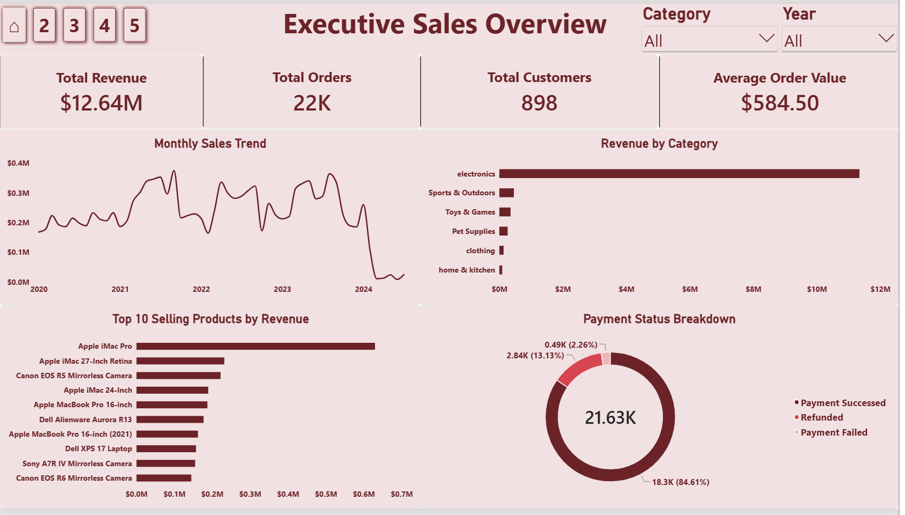
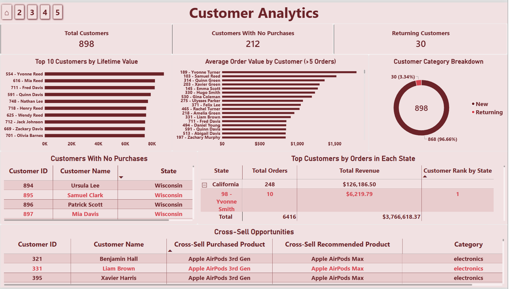
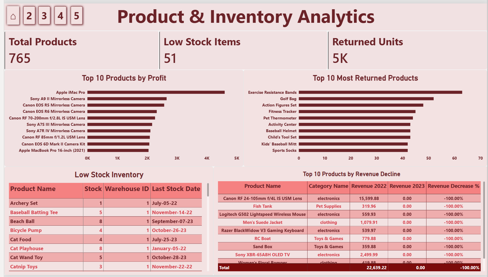
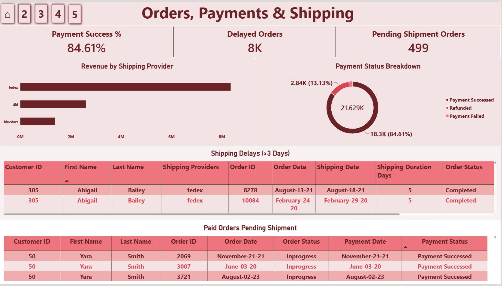
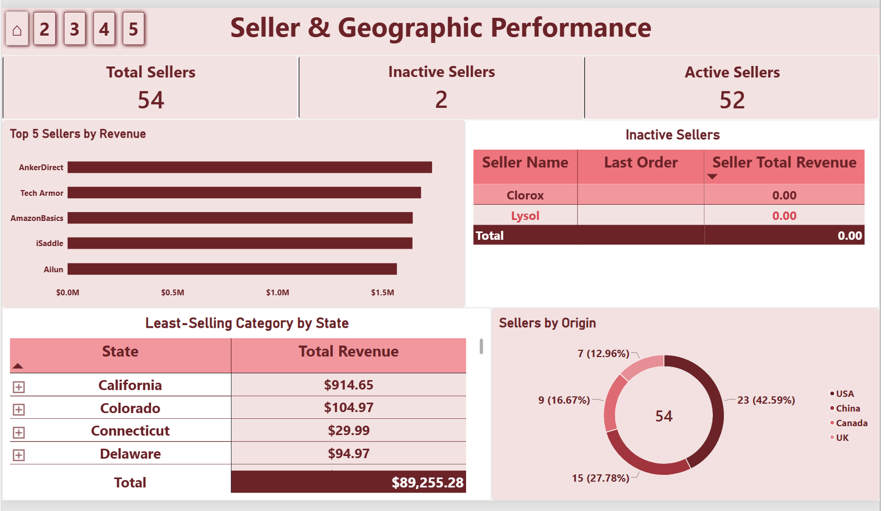

# E-Commerce Analytics | SQL Server + Power BI

End-to-end e-commerce analytics project using **SQL Server** and **Power BI** to analyze sales, customers, products, inventory, payments, shipping, and seller performance through an interactive five-page dashboard.

## Project Overview

This project transforms a normalized e-commerce database into reproducible SQL analysis and an interactive Power BI decision-support report.

The analysis covers:

- Sales and revenue performance
- Customer lifetime value and purchase behavior
- Product profitability, returns, and revenue decline
- Inventory and low-stock monitoring
- Payment and shipping performance
- Seller performance and activity
- Geographic analysis
- Cross-sell opportunities
- Inventory automation with a SQL trigger

## Key Metrics

- **Total Revenue:** $12.64M
- **Distinct Orders:** 21,629
- **Customers:** 898
- **Products:** 765
- **Sellers:** 54
- **Average Order Value:** $584.50
- **Payment Success Rate:** 84.61%
- **Low Stock Products:** 51
- **Inactive Sellers:** 2

## Power BI Dashboard

The report contains five interactive pages:

1. **Executive Sales Overview**
2. **Customer Analytics**
3. **Product & Inventory Analytics**
4. **Orders, Payments & Shipping**
5. **Seller & Geographic Performance**

### Dashboard Preview



### Live Interactive Dashboard

**Power BI live link:** _To be added after publishing._

## Dashboard Pages

### 1. Executive Sales Overview


Highlights:
- Total revenue, orders, customers, and average order value
- Monthly sales trend
- Revenue by category
- Top 10 selling products
- Payment status breakdown

### 2. Customer Analytics


Highlights:
- Customer lifetime value
- Average order value for frequent customers
- Customers with no purchases
- Returning vs New customer classification
- Top customers by orders within each state
- Cross-sell opportunities

### 3. Product & Inventory Analytics


Highlights:
- Top products by profit
- Most returned products
- Low-stock inventory
- Revenue decline from 2022 to 2023

### 4. Orders, Payments & Shipping


Highlights:
- Payment success rate
- Delayed orders
- Pending shipment orders
- Revenue by shipping provider
- Shipping delay details
- Paid orders pending shipment

### 5. Seller & Geographic Performance


Highlights:
- Total, active, and inactive sellers
- Top 5 sellers by revenue
- Inactive seller details
- Least-selling category by state
- Seller origin distribution

## SQL Analysis

The SQL script contains **21 business problems** using:

- JOINs
- CTEs
- GROUP BY and aggregation
- Window functions
- RANK() and LAG()
- Conditional aggregation
- NOT EXISTS
- Date functions
- NULL handling
- Trigger-based inventory automation

See: [sql/Project_3_Questions.sql](sql/Project_3_Questions.sql)

## Project Report

The full project report includes the dataset/model summary, SQL methodology, dashboard explanation, findings, recommendations, and future scope.

See: [report/Project_3_Report.pdf](report/Project_3_Report.pdf)

## Tools Used

- Microsoft SQL Server
- SQL Server Management Studio (SSMS)
- Microsoft Power BI
- DAX
- GitHub

## Key Findings

- Electronics contributes the overwhelming majority of revenue.
- 212 of 898 customers have no recorded purchases.
- 51 of 765 products are below 10 units of stock.
- Payment success rate is 84.61%.
- Approximately 8K orders exceed the three-day shipping threshold.
- 499 successfully paid orders remain Inprogress.
- 52 of 54 sellers are active.

## Repository Structure

```text
ecommerce-sql-powerbi-analytics/
├── README.md
├── sql/
│   └── Project_3_Questions.sql
├── report/
│   └── Project_3_Report.pdf
└── images/
    ├── executive-sales-overview.png
    ├── customer-analytics.png
    ├── product-inventory-analytics.png
    ├── orders-payments-shipping.png
    └── seller-geographic-performance.png
```

## Author

**Talha Fatir**
